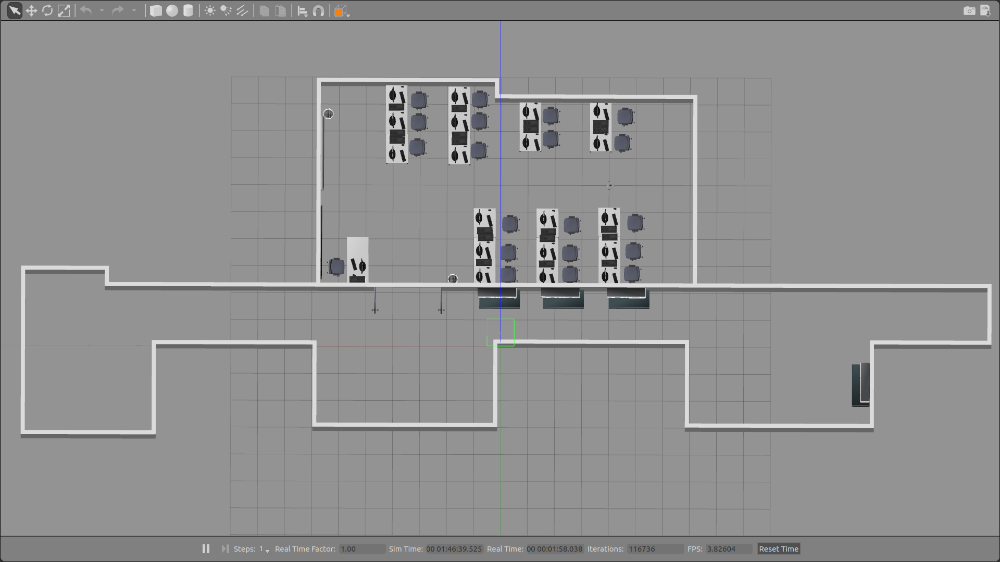
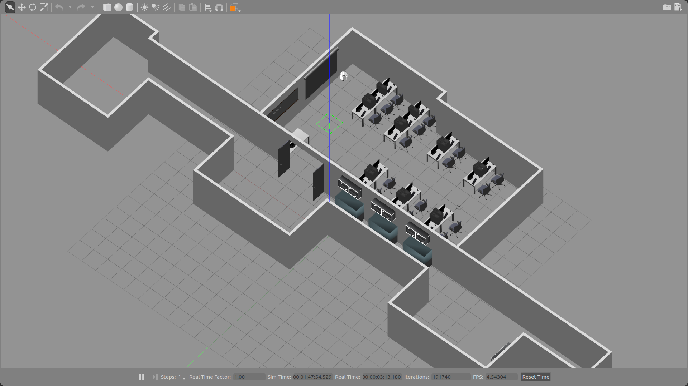
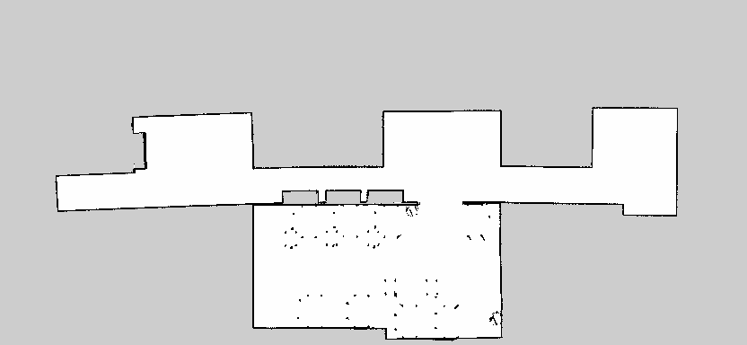

# Homework 2 - Laboratorio Ciberfisico

Secondo homework del corso Laboratorio Ciberfisico, Università degli studi di Verona.

## Consegna

Per completare il secondo homework si richiede di:
1. Creare un mondo Gazebo che replichi uno dei due scenari seguenti:
a. una parte del dipartimento
b. una ricostruzione del circuito TurtleBot3 auto race
2. Generare e salvare una mappa dello scenario creato al punto precedente utilizzando il robot Turtlebot3 virtuale
3. Salvare in un breve video i dati che vengono visualizzati tramite Rviz quando il robot viene inviato, con il comando 2D Nav Goal, in una posizione del mondo virtuale. Il video deve contenere i riferimenti all’autore/agli autori

È necessario fornire nel file README.md un link al video prodotto, che deve essere facilmente scaricabile

## Scelte progettuali

Abbiamo deciso di rappresentare una parte del dipartimento di informatica (Ca' Vignal 2), più precisamente il laboratorio Gamma ed una parte del corridoio.
Per la costruzione dei muri abbiamo preso come riferimento la piantina del dipartimento, notando però delle inesattezze sulle misure. Per la disposizione degli interni abbiamo reperito tutti i modelli su [SketchUp 3D Wharehouse](https://3dwarehouse.sketchup.com/index.html) come consigliato nei tutorial sul software Gazebo. Altre modifiche relative alle dimensioni di questi sono state fatte direttamente in Gazebo.

## Attività
* Andrea Benini (composizione dei modelli nel mondo, creazione launcher, registrazione/editing video)
* Samuele Mori (costruzione della struttura del mondo, creazione script, realizzazione mappa)

La maggior parte del lavoro è stato svolto in coppia sulla stessa macchina, rendendo difficile la suddivisione delle attività.

## Immagini gamma.world





## Installazione e configurazione

Clonare il repository:
```
git clone https://github.com/Samu27/homework2_ros.git
```
Lanciare il setup per la configurazione:
```
./setup.bash
```
Scegliere il modello di turtlebot desiderato ed avviare la simulazione:
```
export TURTLEBOT3_MODEL=waffle
roslaunch turtlebot3_gazebo turtlebot3_gamma.launch
```

## Mappa

Per creare la mappa del mondo abbiamo utilizzato i seguenti comandi:

Terminale1, avvio mondo:
```
roslaunch turtlebot3_gazebo turtlebot3_gamma.launch
```
Terminale2, avvio SLAM (Simultaneous Localization and Mapping):
```
roslaunch turtlebot3_slam turtlebot3_slam.launch
```
Terminale3, avvio RViz:
```
rosrun rviz rviz -d `rospack find turtlebot3_slam`rviz/turtlebot3_slam.rviz
```
Terminale4, avvio teleop:
```
roslaunch turtlebot3_teleop turtlebot3_teleop_key.launch
```
Terminale5, creazione mappa:
```
rosrun map_server map_saver -f ~/map
```



## Video navigazione autonoma

[Link al video](https://raw.githubusercontent.com/Samu27/homework2_ros/master/media/video.mp4)

## Autori

* **Andrea Benini** - [BAnd313](https://github.com/BAnd313)
* **Samuele Mori** - [Samu27](https://github.com/Samu27)

## Licenza

Software distribuito sotto licenza GNU LGPLv3. Vedi `LICENSE` per ulteriori informazioni.
